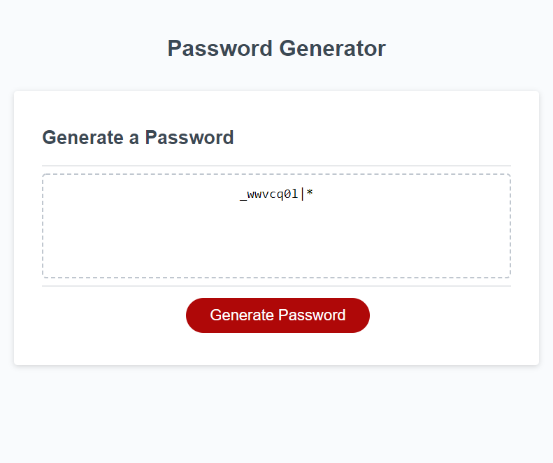
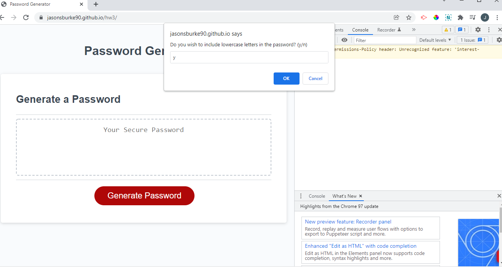

# hw3

## Description

This project is a random password generator. When the user hits generate password, a series of alerts will be prompt them for their input for length of password, if it should contain lower case letters, if it should contain upper case letters, if it should include numbers, and if it should include special characters. Based on each of these inputs it will pull different arrays together to generate the password.

## Screenshots

## Links to application

\* Here is the link to the repo [jasonburke/repo] (https://github.com/Jasonsburke90/hw3)
\*Here is the link to the pages: [jasonburke/pages] (https://jasonsburke90.github.io/hw3/)
